# Tasks for week \#12 and \#13

##PKI LAB

- **Task 1**
    - In this lab, we need to create digital certificates- We will become a root CA ourselves, and then use this CA to issue certificate for others.
    - We start by Copy openssl.cnf into our current working directory.
    - Uncomment the unique_subject line to allow creation of certifications with the same subject.
    - Create the necessary files and directories:
    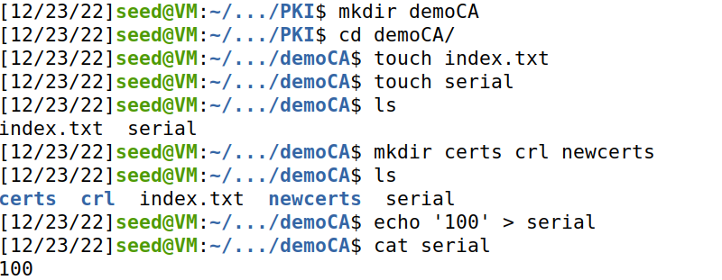
    - Generate a self-signed certificate for our CA
    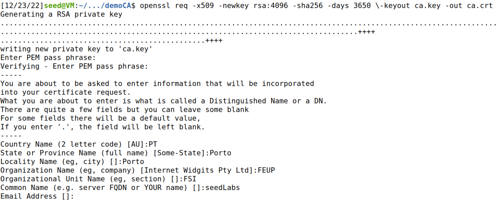
    - Output of openssl x509 -in ca.crt -text -noout:
    
```
    Certificate:
    Data:
        Version: 3 (0x2)
        Serial Number:
            19:91:95:be:32:4c:a1:f6:a5:20:69:e7:2f:a2:d0:3b:c2:83:5e:a3
        Signature Algorithm: sha256WithRSAEncryption
        Issuer: C = PT, ST = Porto, L = Porto, O = FEUP, OU = FSI, CN = seedLabs
        Validity
            Not Before: Dec 23 16:33:19 2022 GMT
            Not After : Dec 20 16:33:19 2032 GMT
        Subject: C = PT, ST = Porto, L = Porto, O = FEUP, OU = FSI, CN = seedLabs
        Subject Public Key Info:
            Public Key Algorithm: rsaEncryption
                RSA Public-Key: (4096 bit)
                Modulus:
                    00:d0:28:b9:e1:8b:f1:bb:94:ad:e2:f8:29:58:ba:
                    b8:74:84:0c:6e:83:9e:b9:09:5b:c9:dc:33:83:4e:
                    9d:8a:40:67:8f:a3:a8:6d:74:6a:c5:f4:74:db:af:
                    68:71:60:bd:6e:79:6e:fe:9d:4d:40:60:fa:ee:95:
                    1e:20:ce:9a:e1:02:2a:ae:78:c4:a4:c5:48:30:d1:
                    b5:e3:5a:9c:4e:7e:00:fd:59:01:9e:dc:16:e4:a4:
                    73:9b:38:56:23:81:85:b3:44:fc:ac:85:d5:91:b0:
                    c2:fb:30:ce:51:00:03:69:b7:10:3d:87:b6:78:7e:
                    78:e2:27:6e:6e:2c:15:4b:c1:d4:56:b2:70:c9:a8:
                    52:b1:48:c3:ce:26:28:23:0a:f7:78:f4:de:cb:f2:
                    a1:93:ea:05:12:84:a6:48:cf:d4:4f:86:a0:88:e5:
                    ca:93:53:db:c3:07:6d:5d:10:5c:a4:2c:15:42:5d:
                    c2:a8:d0:b3:20:e2:ad:97:95:c7:9f:f7:88:da:12:
                    61:6d:b5:bd:6d:3f:38:5e:1e:d2:76:d0:a3:08:72:
                    cf:ec:d2:72:f3:1d:e1:a4:f6:08:b8:ab:34:44:8f:
                    3a:50:72:dc:d4:67:8f:dc:e7:f4:da:17:34:22:5d:
                    4e:24:4d:a2:76:22:9a:c9:44:14:bc:27:3c:52:25:
                    c5:5d:7c:a7:bc:8a:d7:85:79:71:c2:6f:0d:46:79:
                    a4:4a:8d:c6:e3:21:75:ff:83:76:9d:fe:d0:95:fd:
                    b4:1c:34:90:f5:ba:3c:73:d1:39:58:c3:91:d1:0e:
                    3d:f0:5d:bd:f7:43:e2:48:6f:e0:16:1f:4b:a6:2a:
                    f9:66:3b:71:69:04:71:e7:0f:af:e6:c5:47:c2:9a:
                    dd:f4:f8:de:a0:b2:30:35:17:c1:5b:2d:e3:fa:d5:
                    e4:61:12:2e:60:f5:f8:b7:de:2f:8a:2b:43:5e:4a:
                    39:bb:18:52:d5:02:28:64:ec:e9:0c:4b:cc:eb:b5:
                    ba:0a:6b:6d:1a:29:5f:73:49:cd:fe:80:7f:dc:fa:
                    9a:2e:73:1f:c0:ce:b3:be:90:5d:27:fe:ba:c2:8f:
                    83:89:e6:0c:a2:cc:9c:91:6a:c5:f2:72:84:95:4b:
                    65:14:85:13:50:95:97:61:00:00:37:f4:8b:31:5d:
                    1c:73:7f:1d:e4:36:ce:e6:86:b5:21:16:e4:d5:f1:
                    0b:b0:77:40:aa:39:11:6d:60:2a:97:dd:5c:e3:e5:
                    5f:81:c6:dc:c1:3a:94:ce:3a:0a:51:cf:92:b0:88:
                    0b:c3:4f:4e:d6:ef:84:89:4d:10:4f:7a:a6:11:1d:
                    3f:17:02:4a:6d:c2:0e:45:5c:63:b7:f5:3d:a7:4d:
                    0c:ce:77
                Exponent: 65537 (0x10001)
        X509v3 extensions:
            X509v3 Subject Key Identifier: 
                81:C3:95:68:FC:AC:64:E1:89:62:6C:5C:0F:C4:31:1C:F2:63:68:CC
            X509v3 Authority Key Identifier: 
                keyid:81:C3:95:68:FC:AC:64:E1:89:62:6C:5C:0F:C4:31:1C:F2:63:68:CC

            X509v3 Basic Constraints: critical
                CA:TRUE
    Signature Algorithm: sha256WithRSAEncryption
         c1:52:bc:c0:d4:3b:a1:1e:96:97:2e:c6:01:ba:bd:ed:1b:fc:
         48:49:14:fa:67:87:ea:53:fc:24:2b:e0:e8:75:5a:27:2c:2f:
         f3:ef:b9:20:b6:36:d2:f7:fc:4b:97:c1:18:f4:df:2e:f0:ca:
         e4:c8:81:e3:1d:e3:b8:43:65:89:f4:80:ec:24:35:2d:b1:e3:
         6e:e1:bd:42:05:8c:e9:ad:6a:67:11:44:70:aa:fa:b5:85:55:
         ab:61:a7:ef:ac:12:85:ab:84:71:a4:40:32:ff:ea:bb:45:37:
         74:9a:f3:15:ef:dc:bc:68:95:fd:7e:7c:7b:1d:06:db:e6:fe:
         ed:3c:6c:c6:65:a1:a4:17:ee:8c:98:05:e9:02:ed:53:1b:e6:
         27:5e:ff:61:00:10:97:2a:7f:cd:59:f1:7d:4d:97:d9:8f:ab:
         9c:2b:8b:eb:89:6b:ff:19:8d:07:37:c6:40:6a:8c:d5:d2:07:
         b0:27:d3:37:8a:0c:ab:35:ee:04:e3:91:8a:26:47:09:47:c1:
         ba:5a:0d:8c:4f:43:1a:51:0f:ec:35:9c:11:6a:db:90:80:d8:
         65:db:70:06:42:9d:29:61:fb:c5:87:37:de:b7:64:ef:db:aa:
         2d:fb:ab:0e:79:f7:60:d3:dd:ca:e8:4e:2e:bf:81:76:4c:bf:
         1e:4d:15:08:c7:81:99:f5:5d:c1:0d:ed:c1:47:66:d4:59:54:
         e8:20:5d:47:1e:b0:72:a7:ce:7d:64:4f:32:98:86:53:f5:da:
         64:d9:fa:7d:5e:94:ab:c0:7d:3b:dc:07:79:ce:a6:23:bb:f2:
         c9:91:51:48:3f:e2:83:2f:4f:b5:1b:e1:8a:30:5a:69:1b:a2:
         52:fc:ff:a0:40:b9:03:c9:9c:41:25:dc:65:85:ba:c5:68:aa:
         f6:82:2f:cb:b4:bd:2f:7b:36:8c:a5:e7:23:56:cc:a4:ec:51:
         1e:39:7b:1a:59:ca:64:14:18:6a:2d:e1:f4:d9:56:5a:f8:ce:
         12:a2:fc:dc:bb:18:8c:90:a1:ef:d1:f9:7d:cb:c7:a7:16:51:
         e7:39:3c:05:99:43:7d:f6:26:17:7a:7c:3d:b4:8a:e5:08:1c:
         92:c8:b0:d5:e8:05:2b:1a:d7:cc:0c:66:a2:d0:70:25:5e:d4:
         25:a8:c5:cb:44:6a:23:0d:73:f6:59:69:2d:e8:fe:56:a7:38:
         f4:4c:f7:2f:e6:1a:d6:17:de:5f:a7:b4:0f:a4:07:aa:ef:82:
         b5:df:32:b2:46:97:8a:d2:59:09:7a:29:b9:40:83:35:ee:b7:
         ca:76:71:8b:16:5a:94:6d:a3:b0:54:7f:d2:15:c4:70:5d:a3:
         73:2f:a9:b0:7b:a7:36:f4

```
    - Output of openssl rsa  -in ca.key -text -noout:
```
Enter pass phrase for ca.key:
RSA Private-Key: (4096 bit, 2 primes)
modulus:
    00:d0:28:b9:e1:8b:f1:bb:94:ad:e2:f8:29:58:ba:
    b8:74:84:0c:6e:83:9e:b9:09:5b:c9:dc:33:83:4e:
    9d:8a:40:67:8f:a3:a8:6d:74:6a:c5:f4:74:db:af:
    68:71:60:bd:6e:79:6e:fe:9d:4d:40:60:fa:ee:95:
    1e:20:ce:9a:e1:02:2a:ae:78:c4:a4:c5:48:30:d1:
    b5:e3:5a:9c:4e:7e:00:fd:59:01:9e:dc:16:e4:a4:
    73:9b:38:56:23:81:85:b3:44:fc:ac:85:d5:91:b0:
    c2:fb:30:ce:51:00:03:69:b7:10:3d:87:b6:78:7e:
    78:e2:27:6e:6e:2c:15:4b:c1:d4:56:b2:70:c9:a8:
    52:b1:48:c3:ce:26:28:23:0a:f7:78:f4:de:cb:f2:
    a1:93:ea:05:12:84:a6:48:cf:d4:4f:86:a0:88:e5:
    ca:93:53:db:c3:07:6d:5d:10:5c:a4:2c:15:42:5d:
    c2:a8:d0:b3:20:e2:ad:97:95:c7:9f:f7:88:da:12:
    61:6d:b5:bd:6d:3f:38:5e:1e:d2:76:d0:a3:08:72:
    cf:ec:d2:72:f3:1d:e1:a4:f6:08:b8:ab:34:44:8f:
    3a:50:72:dc:d4:67:8f:dc:e7:f4:da:17:34:22:5d:
    4e:24:4d:a2:76:22:9a:c9:44:14:bc:27:3c:52:25:
    c5:5d:7c:a7:bc:8a:d7:85:79:71:c2:6f:0d:46:79:
    a4:4a:8d:c6:e3:21:75:ff:83:76:9d:fe:d0:95:fd:
    b4:1c:34:90:f5:ba:3c:73:d1:39:58:c3:91:d1:0e:
    3d:f0:5d:bd:f7:43:e2:48:6f:e0:16:1f:4b:a6:2a:
    f9:66:3b:71:69:04:71:e7:0f:af:e6:c5:47:c2:9a:
    dd:f4:f8:de:a0:b2:30:35:17:c1:5b:2d:e3:fa:d5:
    e4:61:12:2e:60:f5:f8:b7:de:2f:8a:2b:43:5e:4a:
    39:bb:18:52:d5:02:28:64:ec:e9:0c:4b:cc:eb:b5:
    ba:0a:6b:6d:1a:29:5f:73:49:cd:fe:80:7f:dc:fa:
    9a:2e:73:1f:c0:ce:b3:be:90:5d:27:fe:ba:c2:8f:
    83:89:e6:0c:a2:cc:9c:91:6a:c5:f2:72:84:95:4b:
    65:14:85:13:50:95:97:61:00:00:37:f4:8b:31:5d:
    1c:73:7f:1d:e4:36:ce:e6:86:b5:21:16:e4:d5:f1:
    0b:b0:77:40:aa:39:11:6d:60:2a:97:dd:5c:e3:e5:
    5f:81:c6:dc:c1:3a:94:ce:3a:0a:51:cf:92:b0:88:
    0b:c3:4f:4e:d6:ef:84:89:4d:10:4f:7a:a6:11:1d:
    3f:17:02:4a:6d:c2:0e:45:5c:63:b7:f5:3d:a7:4d:
    0c:ce:77
publicExponent: 65537 (0x10001)
privateExponent:
    41:b3:29:00:2c:58:6e:d9:3d:8c:ee:c0:b6:15:b1:
    14:6d:7d:33:00:6d:ff:7f:19:ae:7b:c6:f2:81:c4:
    ad:97:28:58:a8:d2:07:42:00:55:5c:93:e9:a6:d2:
    73:3e:92:6b:a4:fe:48:74:c3:a6:37:35:dc:49:ca:
    89:96:4c:42:0a:9a:08:19:6c:0f:89:89:00:87:a0:
    3e:13:22:54:8f:e6:a6:10:0a:b7:e6:45:7f:82:fc:
    4e:18:98:ef:79:f9:06:1d:17:17:28:e2:c0:aa:26:
    d0:7b:96:12:f0:cb:22:f9:b9:b1:81:fd:30:c8:d2:
    44:a7:27:6e:b4:91:40:28:fc:69:24:c6:fe:8f:17:
    12:87:a1:ed:96:13:83:03:fa:19:fe:47:b7:dd:6b:
    ec:30:a7:cb:31:7c:fe:6c:42:59:9b:67:5d:ee:11:
    63:30:cb:a3:21:db:fd:cc:a5:40:d7:fd:19:c6:58:
    23:4a:43:cf:74:5c:50:04:e1:4d:f7:26:05:96:59:
    93:f4:11:c6:c2:76:7b:16:85:5d:24:fa:e0:36:c4:
    b3:bd:b4:b4:51:51:1f:ec:db:d1:d5:8f:98:b8:10:
    32:c6:1e:37:18:3c:ca:ff:97:43:a2:a1:3c:db:70:
    47:7b:0d:74:f5:f5:1e:e3:53:1c:13:d2:31:27:64:
    c4:4c:50:cf:3b:b5:4a:8d:e3:54:1a:8c:eb:14:c7:
    3e:e6:62:dc:cd:dc:b1:a8:00:1f:9d:c3:5e:f3:92:
    07:2e:aa:53:d3:7a:42:36:18:56:26:0f:27:06:d2:
    b0:c5:af:14:4a:e8:b8:04:15:c7:55:6a:d3:09:1a:
    12:42:22:c0:4b:4e:48:d5:4f:85:d4:7c:87:fc:e6:
    b6:f1:59:95:d7:94:6a:5e:ff:60:a2:a1:9a:1d:3a:
    46:37:6b:27:8d:2a:bb:15:4a:fd:8a:2b:3c:eb:25:
    f7:c7:a6:b0:19:e2:ac:10:ad:cd:3c:bf:0e:65:5c:
    b1:75:9c:aa:fb:78:85:2c:48:9d:af:f7:f3:02:0e:
    69:b7:10:1b:4c:7f:b3:a3:5e:06:a7:a6:13:97:ba:
    fc:1c:bb:76:1e:fd:09:f3:97:7f:2e:ae:37:7a:2f:
    48:b8:08:59:27:7c:66:11:dd:0a:40:ca:3e:7c:45:
    95:9b:50:c7:b3:61:76:e6:c8:13:68:35:c7:e3:bc:
    2a:5e:84:81:d0:ef:38:38:9c:50:b1:5b:de:99:3a:
    79:ef:25:d5:4f:eb:ff:68:29:d4:df:9f:4f:6f:2a:
    e3:42:55:38:6a:41:47:15:7b:5c:26:1c:0e:01:e8:
    21:7b:78:30:89:b9:74:12:d3:07:53:ea:ee:e4:36:
    cf:41
prime1:
    00:ea:02:47:74:83:12:15:5b:04:7a:25:17:17:a1:
    bb:a8:04:27:46:b4:c4:85:30:09:b8:df:0b:c3:73:
    90:a1:c6:40:20:a6:eb:99:4a:87:ff:b4:f9:4f:9d:
    ea:27:5f:bd:3a:1a:4e:68:ee:e9:a0:c1:1c:34:93:
    e8:d8:65:86:c4:92:be:76:19:fd:c3:65:46:bd:41:
    a3:82:33:c9:9e:9d:0a:89:03:c2:f5:25:93:d7:26:
    f5:b0:64:06:83:c2:93:fc:d6:1b:d6:76:2d:37:54:
    85:46:4b:5f:55:bb:31:ee:3e:59:39:2e:02:51:20:
    35:10:c9:c5:54:b6:ab:ff:c7:34:c2:ba:9c:7a:fb:
    bc:df:f3:66:54:24:d6:b9:b0:f1:2d:c1:fa:40:97:
    e4:9b:c8:52:4d:ee:1a:1c:1d:bd:18:5c:dd:96:88:
    22:19:01:56:4b:08:fc:71:ad:62:a4:fa:7f:ed:87:
    b3:ab:47:84:0b:90:8a:37:1c:5a:61:d7:0b:02:86:
    0e:c7:ce:c9:74:82:48:67:52:b1:ee:97:ff:31:23:
    f2:2f:64:39:30:9a:38:29:bf:f7:69:f2:49:99:ad:
    ff:22:f7:41:aa:62:39:67:a1:b9:cc:6a:2d:dc:65:
    34:a9:55:ab:c7:4e:68:b5:fe:b0:b2:06:a9:56:b0:
    2a:61
prime2:
    00:e3:b8:8f:2e:9a:f7:74:4d:91:7d:a3:57:5f:b4:
    38:aa:4f:0a:1c:b3:73:0c:69:75:b7:cd:d0:4a:1b:
    2f:4d:05:77:10:da:09:ab:15:fb:9e:62:51:70:76:
    06:54:dd:5a:bf:99:3b:a5:d1:1d:4e:6e:e8:e9:b8:
    d3:7c:28:4e:70:d9:66:e8:05:61:50:c3:fe:df:b7:
    de:90:17:fe:c0:93:d2:a1:ed:3c:1e:54:87:1c:fb:
    7a:ee:21:8b:1e:10:11:70:87:19:d6:68:30:69:c0:
    9a:41:e0:f2:c0:7a:8a:90:59:04:a6:3a:21:96:76:
    93:78:e2:38:2d:a3:2a:04:11:22:85:34:2a:c0:ec:
    27:f7:de:18:42:4f:0b:0c:3a:73:db:fd:68:7b:7d:
    fb:9a:ca:89:05:fc:d5:15:ee:88:45:1c:5d:e3:56:
    9e:26:34:ca:16:9b:57:fd:ae:b9:77:75:ac:31:c2:
    f0:41:a8:85:9d:f7:d9:b0:b9:8e:e6:58:7b:39:1f:
    e2:df:cf:ee:af:7b:70:91:45:fa:e0:8a:c0:3a:fb:
    9f:b5:c5:3b:9e:96:62:93:b5:a0:fc:17:d7:e1:cc:
    ef:89:51:65:ec:ee:e8:ee:0d:79:4f:08:c9:07:5f:
    ec:d2:97:b6:c7:b9:0b:90:7c:d6:90:2d:bc:b0:5a:
    97:d7
exponent1:
    00:d9:93:aa:ea:9b:1f:ca:39:69:6d:44:65:37:34:
    ca:ad:8a:c7:16:07:e7:9d:4a:b0:0f:73:5b:95:ac:
    32:f3:27:c8:e2:53:31:45:c3:35:b6:3c:87:7e:4e:
    7e:b3:83:62:06:cf:04:ce:ae:2d:0d:a9:df:d6:c7:
    1b:bd:70:90:a0:df:2c:35:d5:2e:cc:69:b3:1f:2f:
    13:9f:71:15:6a:e3:eb:32:c0:0b:9a:32:09:47:07:
    d3:72:e1:5d:e9:4e:96:98:84:5f:37:c5:83:7f:29:
    98:0d:66:f1:4a:5e:16:2b:c5:4e:e2:4a:74:1f:08:
    0a:2f:04:db:f4:4b:30:9b:4e:96:30:e4:9f:af:fd:
    b6:7c:a7:ec:22:1a:6a:88:17:0b:f8:16:9e:df:46:
    1b:69:f9:15:05:9e:78:2a:62:40:3a:91:c5:fa:3b:
    b3:30:7a:bc:c8:61:9f:8e:f6:be:7c:54:e9:73:6a:
    34:54:f1:d6:c5:85:eb:ed:17:f0:b5:7d:e3:9f:c2:
    13:a6:16:0f:db:c3:73:1c:96:98:18:16:bd:50:ec:
    72:37:3c:41:ac:7e:07:f0:51:ab:f2:97:33:75:af:
    81:44:fa:8e:d4:a4:25:69:c4:c6:63:58:ea:31:3c:
    ec:7c:f1:ca:19:33:3f:4a:d0:77:6b:df:a3:bd:95:
    68:a1
exponent2:
    00:a0:7d:36:0b:f6:93:67:98:33:6d:84:6c:d3:ba:
    44:25:63:47:11:2b:37:6e:0b:f5:36:f1:0a:56:f0:
    09:ca:12:8b:f3:88:77:3f:e8:62:49:21:a9:9b:c4:
    d2:79:84:f7:ac:08:e6:8c:da:6f:f9:13:19:7b:7f:
    13:2d:71:8a:b6:e5:c1:2c:cc:7d:e5:59:fc:8a:d7:
    1f:38:16:71:28:70:06:06:b1:17:a9:98:91:10:cf:
    fb:b7:50:54:a7:7f:53:8b:26:ec:02:bb:b3:43:14:
    c6:a2:9f:52:f6:6c:66:b3:8c:c9:46:0d:ba:16:3c:
    c3:7a:72:94:7d:35:7d:2b:18:98:67:a0:78:71:36:
    fe:84:26:36:9a:a4:f2:78:4f:c9:cf:c5:2c:99:bc:
    14:52:e7:62:e2:a1:69:db:e7:1c:8a:f8:8f:02:e5:
    cc:d7:c8:64:94:c2:2e:a5:4f:3a:cf:02:53:b5:4e:
    59:dd:2c:53:df:1d:0a:83:0e:83:b3:bb:b0:3c:76:
    48:82:cc:1c:bf:f8:13:41:8f:3c:5c:7b:ed:36:a4:
    97:ce:97:8e:89:1a:1b:a7:56:5e:7a:cc:a3:0d:34:
    4d:ad:4d:7c:b4:1b:3c:76:69:70:91:4e:f3:bf:0a:
    cf:f1:2b:93:59:f7:04:3b:74:80:13:64:e8:92:b1:
    86:49
coefficient:
    7f:31:41:2f:66:86:2e:82:8b:9b:31:f4:81:62:05:
    11:41:01:f9:c1:0d:b5:56:13:f7:29:1f:e9:1d:c8:
    41:64:b2:09:13:7e:2c:79:d2:d5:12:d8:4b:5f:17:
    cd:d9:a9:aa:50:64:d6:df:40:c2:1c:9d:c2:7d:be:
    94:a0:ae:19:46:e3:bc:4f:c9:0f:3b:5f:bd:66:54:
    00:48:87:38:cd:6f:57:86:6d:06:2a:86:62:bf:91:
    37:2a:55:e4:9a:b6:b3:46:de:dc:8f:fd:88:34:99:
    c3:d9:5a:6a:c5:f8:c3:cd:55:dc:ec:33:bc:c3:26:
    f4:98:bc:44:88:14:b2:e3:86:2f:07:c0:b5:44:9a:
    c9:ab:dd:a0:6c:64:f1:c4:9a:13:75:80:28:88:e7:
    90:a8:5a:aa:c8:83:d5:01:e1:2f:b2:bc:3b:d0:72:
    0a:36:cf:5b:16:5b:a4:1b:61:f3:f3:4b:4b:76:c6:
    16:d2:06:3c:b7:fc:42:17:d7:e2:9f:49:03:2b:27:
    56:e7:75:db:e4:74:b2:58:73:57:68:40:33:07:d4:
    6a:06:02:db:4f:5f:67:bd:75:ca:ed:27:b6:ef:b8:
    6f:5c:13:78:78:29:b7:7f:c2:52:fb:0e:41:31:52:
    6d:a9:e2:a4:94:90:e3:25:fd:ab:3e:00:f2:6a:32:
    a2

```
-Questions:
    - What part of the certificate indicates this is a CA’s certificate?
        - CA:TRUE
        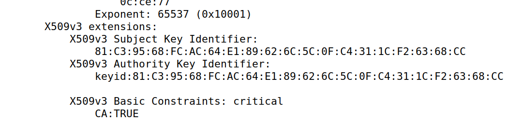
    - What part of the certificate indicates this is a self-signed certificate?
        - The authority Key identifier is the same as the Subject Key Identifier

- **Task 2**:
    - For this task, we used the following command to generate a CSR for www.bank32.com
    ```
        openssl req -newkey rsa:2048 -sha256 \
        -keyout server.key -out server.csr \
        -subj "/CN=www.bank32.com/O=Bank32 Inc./C=US" \
        -passout pass:dees \
        -addext "subjectAltName = DNS:www.bank32.com, \
        DNS:www.bank32A.com, \
        DNS:www.bank32B.com"
    ```

- **Task 3**
    - The CSR file needs to have the CA’s signature to form a certificate
    - We run the following command: 
    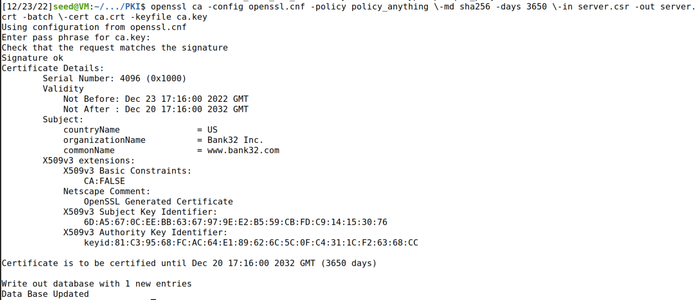

- **Task 4**
    - Following the example provided HTTPS we
create our own directory.
    - Site directory:
    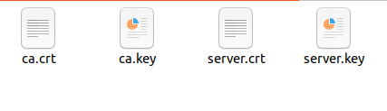
    - Certs directory:
    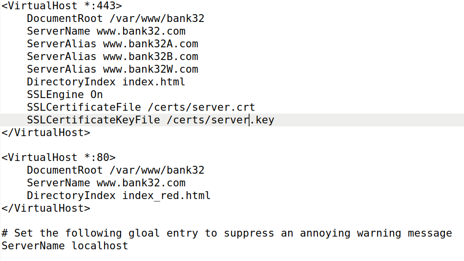
    - bank32_apache_ssl.conf
    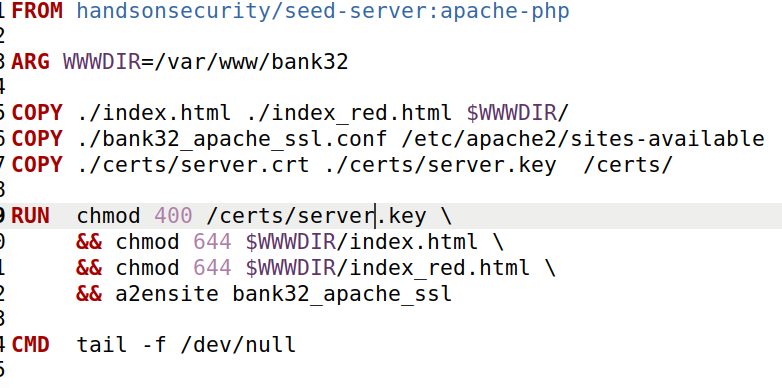
    - Dockerfile files
    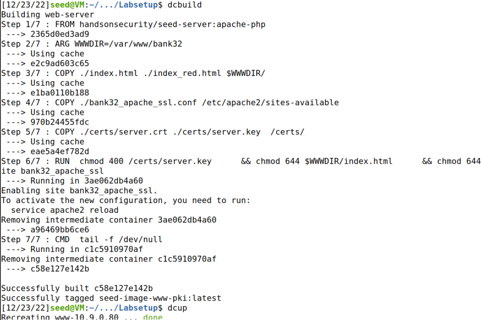
    
    - Build and Start the docker container
    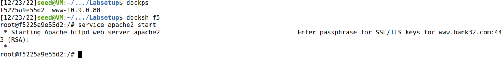
    - Open shell and start apache service
    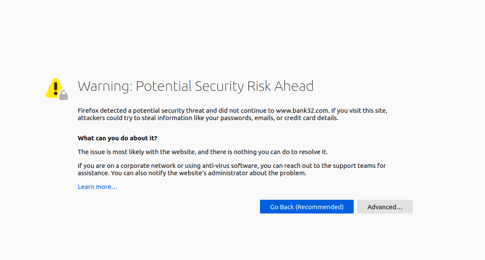
    
    - When we try to enter the website and a warnig pop up appears
    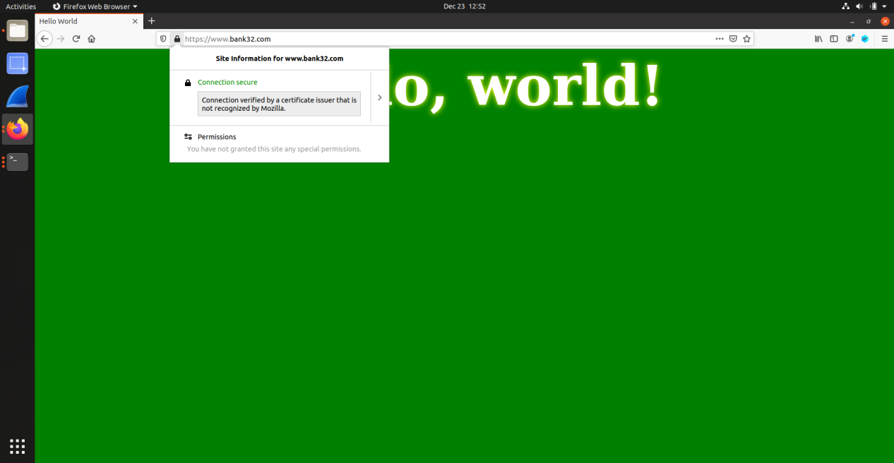
    - To solve this we need to add our certificate to firefox.After adding we can successfuly visit the site
    ![task4.8](docs/logbook11/task4.8.png

- **Task 5**    
    - Step1:
        - Change ther server name to wwww.instagram.com
        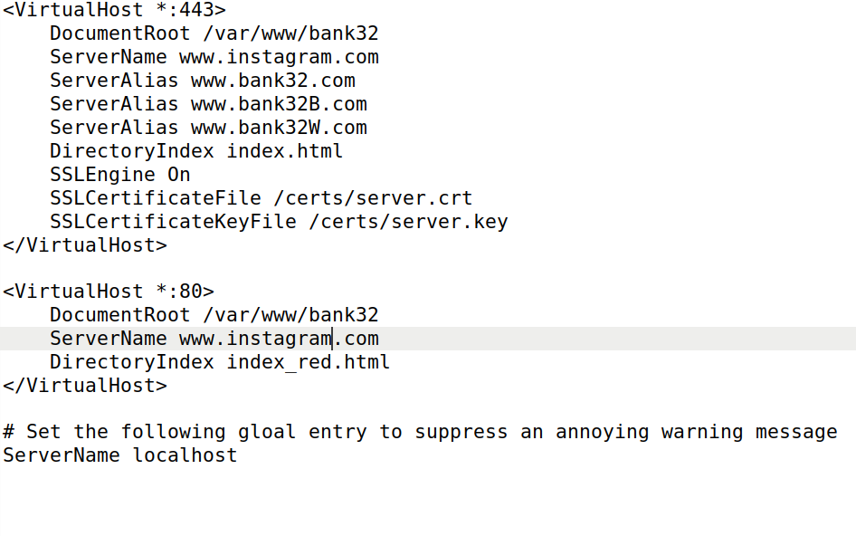
    - Step 2:
        - Become man in the middle by mapping the hostname www.instagram.com to our malicious web server:
        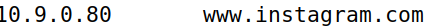
    - Step 3:
        - Browse www.instagram.com and the browser displays the following warning:
        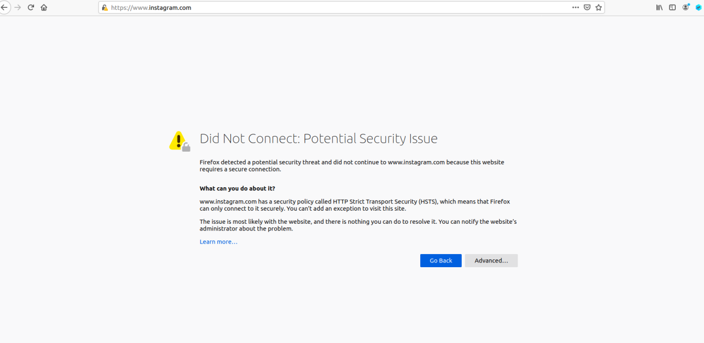


