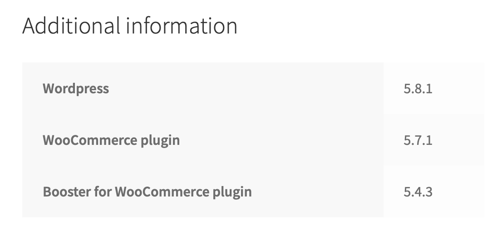
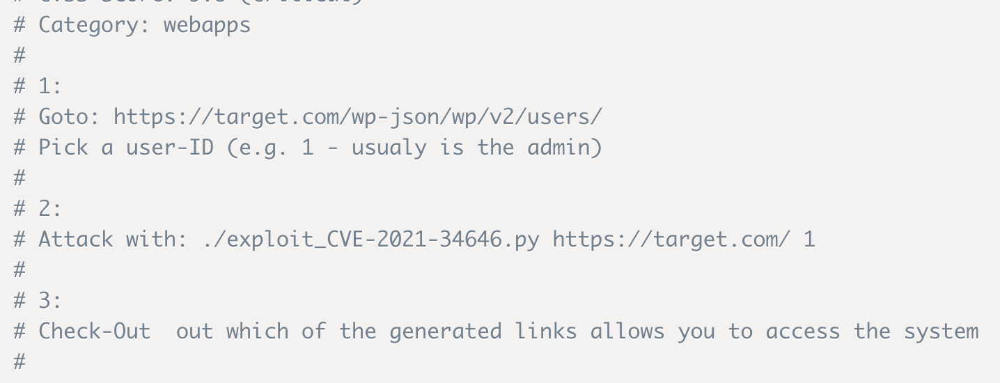
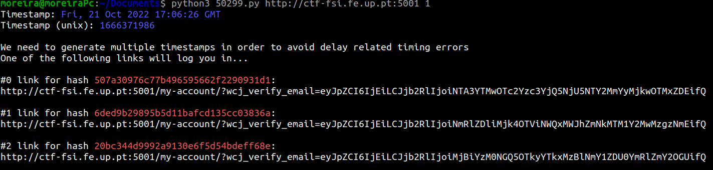
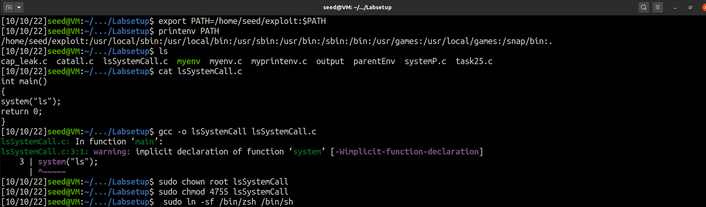
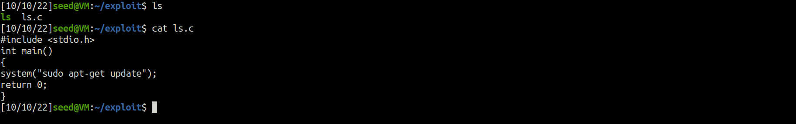
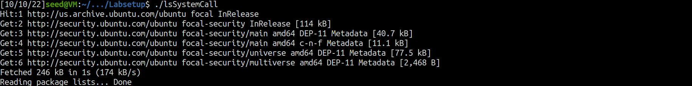

# Tasks for week \#4

## CTF

### Challenge 1

After exploring the website, we found some important information about versions, plugins installed and the active accounts on the website.

Regarding the version and plugins installed:


```
Active users:
- admin
- Orval Sanford
```

With some research on CVE databases, we found a vulnerability in the Booster for WooComerce plugin, which was the one used to attack the website. The CVE was `CVE-2021-34646`, with a CVSS score of 7.5 according to the website https://www.cvedetails.com. 

This vulnerability focus in the process_email_verification function due to a random token generation weakness in the reset_and_mail_activation_link.
This allows attackers to impersonate users, including administrative accounts and automatically be logged in as that user.

Flag:
```
flag{CVE-2021-34646}
```

### Desafio 2

With some research, we found an exploit, https://www.exploit-db.com/exploits/50299, and just followed the instructions given.


Running the script, we get this:


After logging in, we only needed to head to the following page http://ctf-fsi.fe.up.pt:5001/wp-admin/edit.php, where we found a private post with the flag.


Flag:
```
flag{please don’t bother me}
```

---

## Environment Variable and Set-UID Program Lab

- **Task 1**:
  - Environment variables are a set of dynamic named values that can affect the way running processes will behave on a computer.
  - Using the command printenv we can list all environment variables.
  
  
  - Using export and unset we can set or unset envorinment variables.
  - In this screenshot we show how to set a environment variable **OURENV** to the value "G0808" using **export** and also how to unset it using the command **unset**
  

- **Task 2**:
  - First, we executed the code, printing the environment variables for the child proccess (childEnv).
  - Then we altered the code so it would print the environment variables for the parent process (parentEnv).
  - Finally, we compared them using the diff command and conclude that the son inherited the parent's environment variables. 


- **Task 3**:
  - First, we executed the code and nothing was printed.
  - Then we changed the last argument of execve() to *environ* and the environment variables were printed.
  - We can conclude that the environment variables need to be passed by the parameter *environ*.


- **Task 4**:
  - With the system() call, all environment variables are passed to the new program /bin/sh.


- **Task 5**:
  - After compiling and setting this program as a SET-UID program we set the LD_LIBRARY_PATH and ANY_NAME environment variables to "something" and "else", respectively.
  - Since we are executing a program with root privileges in a user account some environment variables will not be exported. As we can see in the screenshot only the ANY_NAME environment variable was exported correctly to "else".


- **Task 6**:
  - To execute this exploit first we add the directory /home/seed/exploit to the beginning of the PATH.
  - In this directory, we create an executable called "ls" that executes a system call with "sudo apt-get update". Only root-users should be able to execute this command.
  - After this we create the given code that uses the relative path for the ls command and set it as a SET-UID program.
  - When executing this code the operative system will search for the first "ls" match. As we changed the PATH the system will start looking in our folder and the first occurrence is our "ls" executable.Therefore, a "sudo apt-get update" will execute.
  
  
  