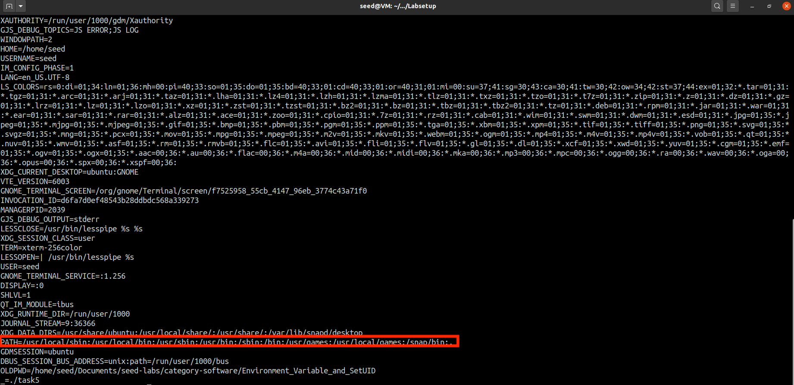

# Tasks for week \#4

- **Task 1**:

- **Task 2**:
  - First, we executed the code, printing the environment variables for the child proccess (childEnv).
  - Then we altered the code so it would print the environment variables for the parent process (parentEnv).
  - Finally, we compared them using the diff command and conclude that the son inherited the parent's environment variables. 

- **Task 3**:
  - First, we executed the code and nothing was printed.
  - Then we changed the last argument of execve() to *environ* and the environment variables were printed.
  - We can conclude that the environment variables need to be passed by the parameter *environ*.

- **Task 4**:
  - With the system() call all environment variables are passed to the new program /bin/sh.

- **Task 5**:
  - Only the PATH and ANY_NAME variables set in the shell process got into the Set-UID child process. That didn't happen with the LD_LIBRARY variable.

- **Task 6**:
  - Only the PATH and ANY_NAME variables set in the shell process got into the Set-UID child process. That didn't happen with the LD_LIBRARY variable.
  
