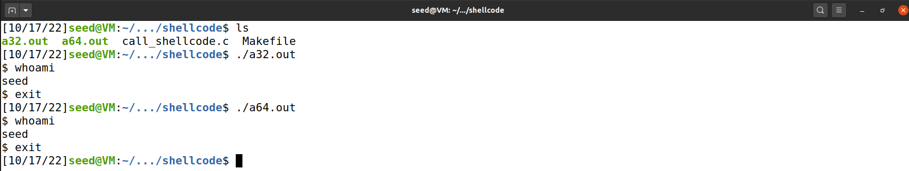
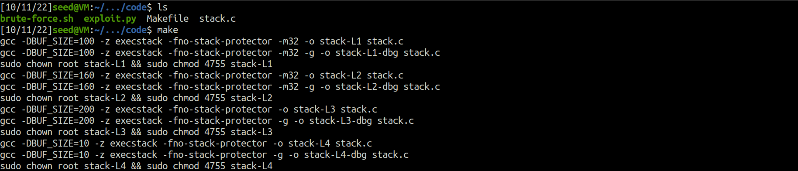
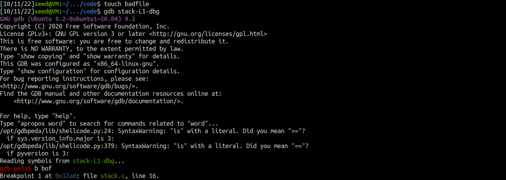
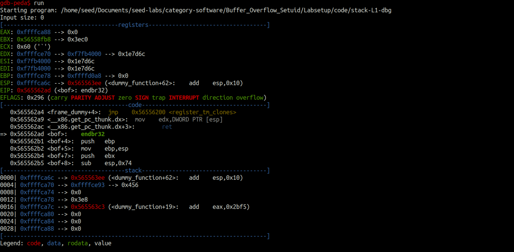
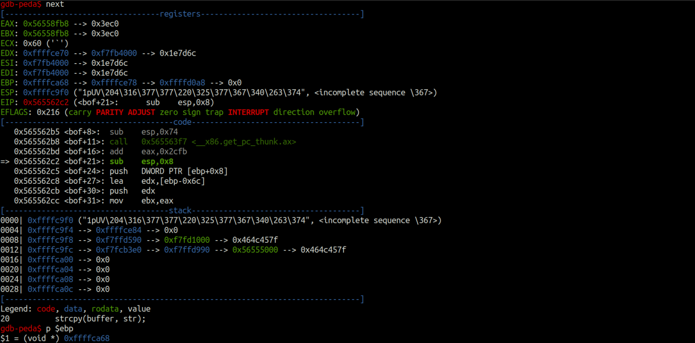
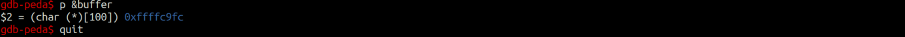
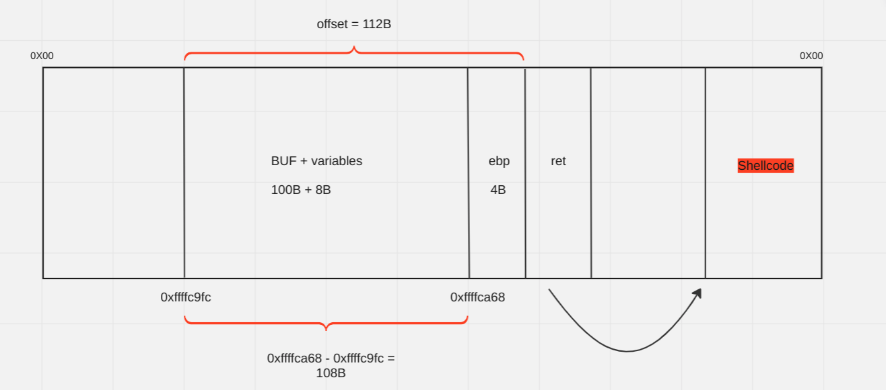
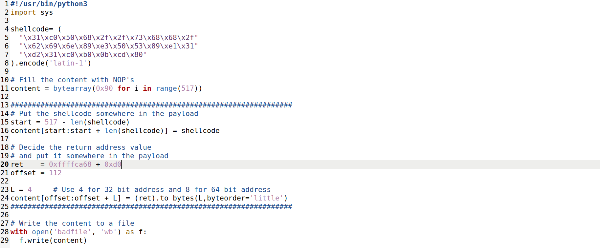
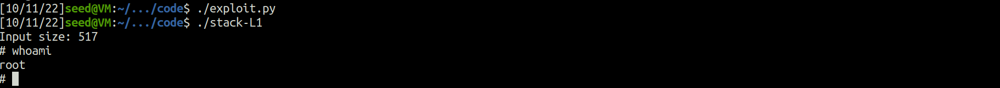

# Tasks for week \#5

## CTF

### Challenge 1

- After looking at the program source code we verified that we could cause a buffer overflow in the scanf function through the buffer. Thus, a chain of 20 random chars was created to fill the buffer in addition to 8 chars to replace "mem.txt" for the desired name "flag.txt". Changing the "mem.txt" we manipulate which file is going to be open.

### Challenge 2

- After looking at the program source code we verified that in addition to a 20 chars buffer and a 8 chars buffer with the name of the file that is going to be open, there is also a 4 char buffer (val) with the value "\xef\xbe\xad\xde". To execute the part of the program which opens the file, the following condition must be fulfilled (*(int*)val == 0xfefc2223). Thus, when causing buffer overflow in the scanf function, the val buffer has to be filled with the value "\x23\x22\xfc\xfe". To sum up, our overflow payload will be filled with 20 random chars, the value "\x23\x22\xfc\xfe" and the name of the file we want to open "flag.txt".

 apos observar o codigo fonte do program verificamos que alem de um buffer de 20 chars e um buffer de 8 chars com o nome do ficheiro a abrir havia tambem um buffer de 4 chars (val) com o valor "\xef\xbe\xad\xde". Para executar a parte do codigo que abre o ficheiro teriamos que obedecer a seguinte condição: (*(int*)val == 0xfefc2223). Deste modo, ao executar o buffer overflow na função scanf, o buffer val terá que ser preenchido com o valor "\x23\x22\xfc\xfe". Em suma o nosso payload de overflow será preenchido com 20 chars aleatorios, mais o valor "\x23\x22\xfc\xfe" mais o nome do ficheiro que pretendemos abrir (flag.txt). 

---

## Buffer Overflow Setuid Lab

- **Task 1**:
    - Compile code and execute

- **Task 2**:
    - The program has a vulnerability since the strcpy doesn't check sizes.
    - When our input file is bigger than the buf size, a buffer overflow occurs.
    - Since this program is root-owned SET-UID the user might be able to get a root shell while exploiting this buffer overflow.

- **Task 3**:
    - To exploit this vulnerability firstly and most importantly we need to find the distance between the buffer's starting position and the place where the return-adress is stored. After finding this information, we must change the return adress to a position where we have our shellcode.
    - To find the distance between the buffer's starting position and return adress with gdb:
        - First set a break point at bof().
        - The program stops before the ebp register is pointing to the current stack frame. Using the gdb's 'next'  command we can get the current stack frame and the buffer's adress.
        - ebp -> 0xffffca68
        - buffer -> 0xffffc9fc

        - Using this values we can represent our stack and calculate the offset between the buffer's starting point and the return address:

    
    - The next step is to prepare our payload, we will be using the following python script:

        - First the payload is filled with NOP's.
        - The shellcode will be allocated to the end of the buffer. This way the start variable is the size of the buffer (517 bytes) minus the shellcode size.
        - The frame pointer obtained from the gdb is different form the actual pointer because gdb has pushed some environment data before running the debugged program, therefore, the frame pointer will be larger. We approach this problem with brute force, after a few tries we found that adding 0xd0 to our return address was enough to complete succesfuly our exploit. 
        - As we can see explained in our stack representation, 112 bytes is the offset between the start of the buffer and the return address: (100 buf bytes + 8 local variables bytes + 4 ebp bytes )
    - Lauching the attack successfully:

