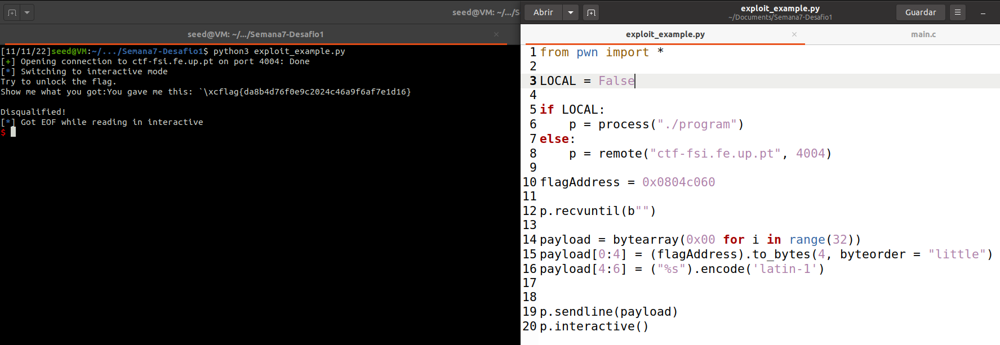

# Tasks for week \#6

## CTF

### Challenge 1
To begin with, we executed the command and got the following result:


We can conclude that:
    - There is a canary preventing the change of the return address of functions (or at least making it harder)
    - The stack has execution permission (NX) - We can execute code that we inject (e.g.: shellcode)
    - The position on the binary aren't randomized (PIE) - we can get the addresses of variables/registers using a debugger.

By analising the source code, it is possible to conclude that the vulnerability is located in the following piece of code:

```c
scanf("%32s", &buffer);
...
printf(buffer);
```
The main objective of this ctf is to find out the value of the global variable 'flag'. Through the gdb, we found out the flag's memory address:


sublinhar endereço de memoria 

This way, we built the payload with the flag's address in descending order and with a '%s'. Thus, the printf command will acknowledge the flag's memory address as a pointer to a string.



### Challenge 2

We started by doing the same procedure as we did in the first challenge: executing the checksec and we got the same result.


By analising the source code, it is possible to conclude that the vulnerability is located in the following piece of code:

```c
scanf("%32s", &buffer);
...
printf(buffer);
```

The main objective of this ctf is to change the value of the global variable 'key' in order to raise a shell. By gaining access to the shell, we will be able to open the flag.txt file. Through the gdb, we found out the key's memory address:


In order to launch a shell, we need to change the value of the variable key to '0xbeef', which in decimal represents 48879. This way, we built our payload with the key's memory address in the first 4 bytes, followed by '%x' with a left pad of (48879 - 4) that equals to 48875. Then, we use the '%n' in order for the printf to load the number of printed characters until that moment to the address of the variable key.

To conclude, we executed the exploit with success and launched a shell where the file 'flag.txt' is located
## Format Strings Seed Labs

- **Task 1**:
    - The purpose of this task is to create a payload so that when the function myprintf is executed the server crashes. By analysing the program code, we verified that the function myprintf uses the function printf without format specifier. Thus, creating a payload with various "%.8x" and passing to the fuction myprintf the server will crash.
    


- **Task 2a**:
    - The purpose of this task is to print the stack. First, we need to choose 4 bytes to allocate in our payload  (0x12345678) to identify when we get to the stack. The rest of the payload is made by "%x". After some tries we found that it was necessary 64 "%x" to get to the value 0x12345678.


- **Task 2b**:
    - The purpose of this task is to print a secret message (string) from the heap. Through the server answers the address of that string was identified (0x080b4008). Then, our input was followed by 63 "%x" + 1 "%s" format specifiers which printed out the data on the stack and the secret message string, respectively.
 
 

  

- **Task 3a**:
    - The purpose of this task was to change the target value to a different value. First, we set the first 4 bytes of our payload as the first bytes of the target address given. Then, the payload was filled with 63 "%x" format specifiers and a "%n" which causes printf to load the number of characters that have been printed by printf before the "%n".

 

  

- **Task 3b**:
    - The purpose of this task was to change the target value to 0x5000. As we explained in task3a "%n" loads the number of characters that have been printed by printf before the "%n". Therefore, to change the target value to 0x5000 we need to print 20480 characters before the "%n". However, the maximum number of characters that we can input is 1500. In order to print 20480 characters we printed 63 "%x": the first 62 with 10 of left-pad and the last one with 19852. To that we add the 8 characters of the target's address. In total, it adds up to 20480 bytes which represents 0x5000 in hexadecimal. 

 

  

